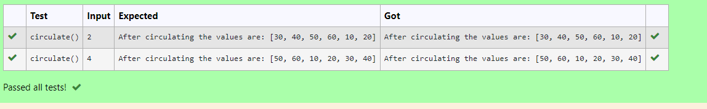

# Circulate-the-values-of-N-variables
## Aim:
To write a python program to circulate the n variables using function concept
## Equipment’s required:
PC
Anaconda - Python 3.7
## Algorithm: 
### Step 1:
 Define a function
### Step 2: 
List the values
### Step 3: 
Get the value from the user for the number of rotation
### Step 4: 
Using the slicing concept rotate the list

### Step 5: 
Print statement
### Step 6:
 End the program
## Program:
```
#Program to circulate N values.
#Developed by:Sowmiya N 
#RegisterNumber:21500134
def circulate():
    l=[10,20,30,40,50,60]
    n=int(input())
    result=l[n:]+l[:n]
    print("After circulating the values are:",result) 

```

## Output:


## Result:
 Thus a python program to circulate the n variables using function concept is written.